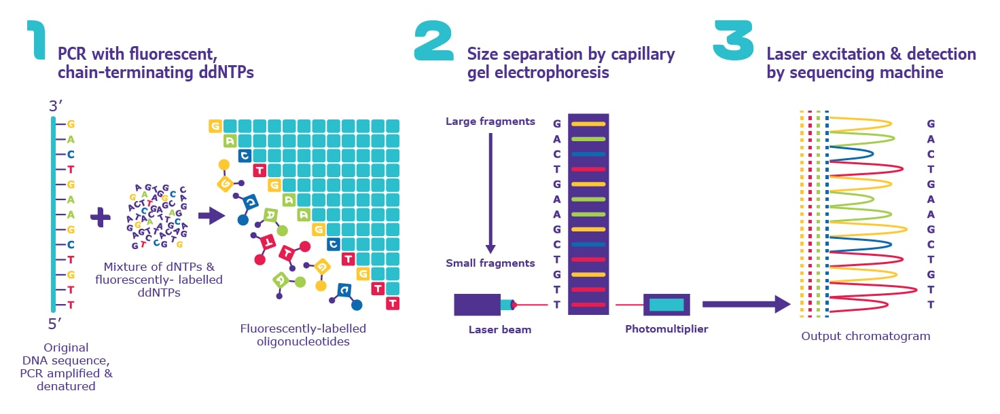
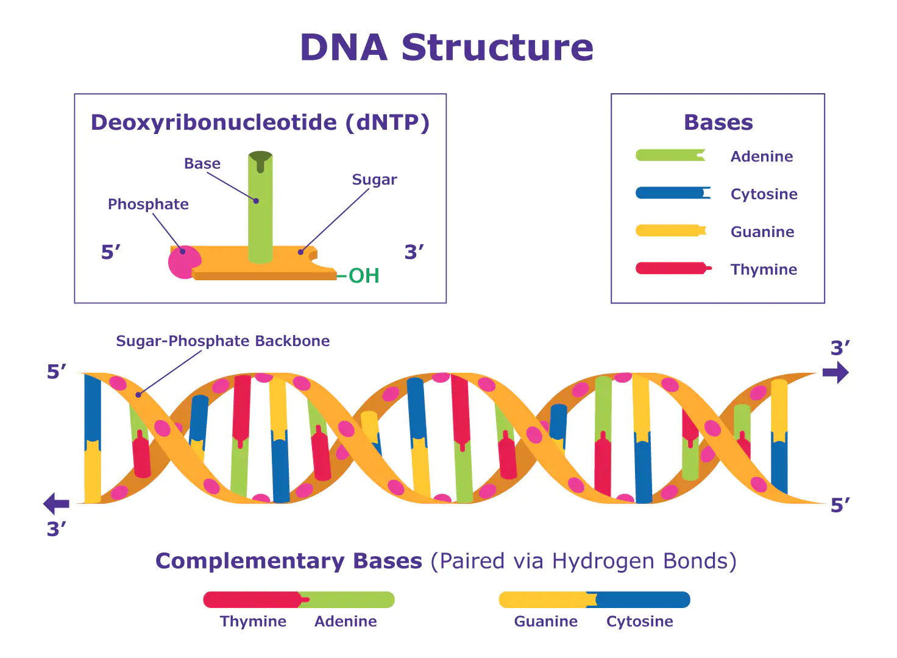

# Sanger Sequencing Steps & Method

## What Is Sanger Sequencing?

Sanger sequencing, also known as the “chain termination method”, is a method for determining the nucleotide sequence of DNA. The method was developed by two time Nobel Laureate Frederick Sanger and his colleagues in 1977, hence the name the Sanger Sequence.

To review the general structure of DNA, please see Figure 2.

## How Does Sanger Sequencing Work?

Sanger sequencing can be performed manually or, more commonly, in an automated fashion via sequencing machine (Figure 1). Each method follows three basic steps, as described below.

### Sanger Sequencing Steps

#### 1. DNA Sequence For Chain Termination Pcr

The DNA sequence of interest is used as a template for a special type of PCR called chain-termination PCR. Chain-termination PCR works just like standard PCR, but with one major difference: the addition of modified nucleotides (dNTPs) called dideoxyribonucleotides (ddNTPs). In the extension step of standard PCR, DNA polymerase adds dNTPs to a growing DNA strand by catalyzing the formation of a phosphodiester bond between the free 3’-OH group of the last nucleotide and the 5’-phosphate of the next (Figure 2).

In chain-termination PCR, the user mixes a low ratio of chain-terminating ddNTPs in with the normal dNTPs in the PCR reaction. ddNTPs lack the 3'-OH group required for phosphodiester bond formation; therefore, when DNA polymerase incorporates a ddNTP at random, extension ceases. The result of chain-termination PCR is millions to billions of oligonucleotide copies of the DNA sequence of interest, terminated at a random lengths (n) by 5’-ddNTPs.

In manual Sanger sequencing, four PCR reactions are set up, each with only a single type of ddNTP (ddATP, ddTTP, ddGTP, and ddCTP) mixed in.

In automated Sanger sequencing, all ddNTPs are mixed in a single reaction, and each of the four dNTPs has a unique fluorescent label.

#### 2. Size Separation By Gel Electrophoresis

In the second step, the chain-terminated oligonucleotides are separated by size via gel electrophoresis. In gel electrophoresis, DNA samples are loaded into one end of a gel matrix, and an electric current is applied; DNA is negatively charged, so the oligonucleotides will be pulled toward the positive electrode on the opposite side of the gel. Because all DNA fragments have the same charge per unit of mass, the speed at which the oligonucleotides move will be determined only by size. The smaller a fragment is, the less friction it will experience as it moves through the gel, and the faster it will move. In result, the oligonucleotides will be arranged from smallest to largest, reading the gel from bottom to top.

In manual Sanger sequencing, the oligonucleotides from each of the four PCR reactions are run in four separate lanes of a gel. This allows the user to know which oligonucleotides correspond to each ddNTP.

In automated Sanger sequencing, all oligonucleotides are run in a single capillary gel electrophoresis within the sequencing machine.

#### 3. Gel Analysis & Determination Of Dna Sequence

The last step simply involves reading the gel to determine the sequence of the input DNA. Because DNA polymerase only synthesizes DNA in the 5’ to 3’ direction starting at a provided primer, each terminal ddNTP will correspond to a specific nucleotide in the original sequence (e.g., the shortest fragment must terminate at the first nucleotide from the 5’ end, the second-shortest fragment must terminate at the second nucleotide from the 5’ end, etc.) Therefore, by reading the gel bands from smallest to largest, we can determine the 5’ to 3’ sequence of the original DNA strand.

In manual Sanger sequencing, the user reads all four lanes of the gel at once, moving bottom to top, using the lane to determine the identity of the terminal ddNTP for each band. For example, if the bottom band is found in the column corresponding to ddGTP, then the smallest PCR fragment terminates with ddGTP, and the first nucleotide from the 5’ end of the original sequence has a guanine (G) base.

In automated Sanger sequencing, a computer reads each band of the capillary gel, in order, using fluorescence to call the identity of each terminal ddNTP. In short, a laser excites the fluorescent tags in each band, and a computer detects the resulting light emitted. Because each of the four ddNTPs is tagged with a different fluorescent label, the light emitted can be directly tied to the identity of the terminal ddNTP. The output is called a chromatogram, which shows the fluorescent peak of each nucleotide along the length of the template DNA.

