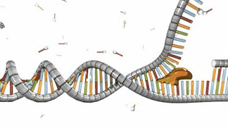
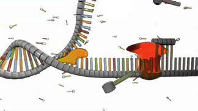
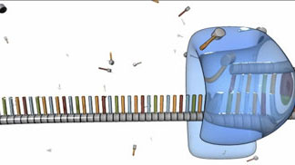

# Cells Can Replicate Their DNA Precisely

[Source](https://www.nature.com/scitable/topicpage/cells-can-replicate-their-dna-precisely-6524830/)

Replication is the process by which a double-stranded DNA molecule is copied to produce two identical DNA molecules. DNA replication is one of the most basic processes that occurs within a cell. Each time a cell divides, the two resulting daughter cells must contain exactly the same genetic information, or DNA, as the parent cell. To accomplish this, each strand of existing DNA acts as a template for replication.

## How is DNA replicated?

A schematic shows a double-stranded DNA molecule undergoing the replication process. The left side of the molecule is double-stranded. In the middle of the molecule, a globular yellow structure, representing the protein helicase, is bound to the ends of several nitrogenous bases on the lower strand.  To the right of the helicase protein, the double helix has opened and the top strand has separated from the bottom. At right, a short segment of the newly replicated double-stranded DNA molecule is visible.

Replication occurs in three major steps: the opening of the double helix and separation of the DNA strands, the priming of the template strand, and the assembly of the new DNA segment. During separation, the two strands of the DNA double helix uncoil at a specific location called the origin. Several enzymes and proteins then work together to prepare, or prime, the strands for duplication. Finally, a special enzyme called [DNA polymerase](https://en.wikipedia.org/wiki/DNA_polymerase) organizes the assembly of the new DNA strands. The following description of this three-stage process applies generally to all cells, but specific variations within the process may occur depending on organism and cell type.

- Helicase (yellow) unwinds the double helix

- While helicase and the initiator protein (not shown) separate the two polynucleotide chains, primase (red) assembles a primer. This primer permits the next step in the replication process.

## What triggers replication?

A schematic shows a double-stranded DNA molecule undergoing the replication process. The left side of the molecule is double-stranded. In the middle of the molecule, a globular yellow structure, representing the protein helicase, is bound to the ends of several nitrogenous bases on the lower strand. To the right of the helicase protein, the double helix has opened and the top strand has separated from the bottom. At right, a short segment of the newly replicated double-stranded DNA molecule is visible.

- Beginning at the primer sequence, DNA polymerase (shown in blue) attaches to the original DNA strand and begins assembling a new, complementary strand.

The initiation of DNA replication occurs in two steps. First, a so-called initiator protein unwinds a short stretch of the DNA double helix. Then, a protein known as helicase attaches to and breaks apart the hydrogen bonds between the bases on the DNA strands, thereby pulling apart the two strands. As the helicase moves along the DNA molecule, it continues breaking these hydrogen bonds and separating the two polynucleotide chains.

A schematic shows a double-stranded DNA molecule undergoing the replication process. At right, the double helix has opened and the top strand has separated from the bottom. A globular yellow structure, representing the protein helicase, is bound to the ends of several nitrogenous bases on the lower strand. A red globular molecule, representing the enzyme primase, is bound to the lower DNA strand to the right of helicase.

## How are DNA strands replicated?

A schematic shows a region of horizontal single-stranded DNA. A transparent blue globular structure, representing the enzyme [DNA polymerase](https://en.wikipedia.org/wiki/DNA_polymerase), is bound to a seven-nucleotide-long region on the right-hand side of the DNA strand. The region of DNA bound by [DNA polymerase](https://en.wikipedia.org/wiki/DNA_polymerase) is visible inside the transparent enzyme at a higher magnification. Six nucleotides in this region are bound to six complementary nucleotides arranged above and in parallel to the single strand, forming red-green or blue-orange pairs. About two dozen individual nucleotides float in the background.

After the primer is in place on a single, unwound polynucleotide strand, [DNA polymerase](https://en.wikipedia.org/wiki/DNA_polymerase) wraps itself around that strand, and it attaches new nucleotides to the exposed nitrogenous bases. In this way, the polymerase assembles a new DNA strand on top of the existing one.

As [DNA polymerase](https://en.wikipedia.org/wiki/DNA_polymerase) makes its way down the unwound DNA strand, it relies upon the pool of free-floating nucleotides surrounding the existing strand to build the new strand. The nucleotides that make up the new strand are paired with partner nucleotides in the template strand; because of their molecular structures, A and T nucleotides always pair with one another, and C and G nucleotides always pair with one another. This phenomenon is known as complementary base pairing, and it results in the production of two complementary strands of DNA.

A schematic shows a region of DNA, with part of the DNA being single-stranded and most of the DNA being double-stranded. A transparent blue globular structure, representing the enzyme [DNA polymerase](https://en.wikipedia.org/wiki/DNA_polymerase), is bound to a several-nucleotide-long region along the DNA strand about a quarter of the way from the left side. The DNA is single-stranded to the left of [DNA polymerase](https://en.wikipedia.org/wiki/DNA_polymerase) and double stranded to the right, indicating that [DNA polymerase](https://en.wikipedia.org/wiki/DNA_polymerase) is moving from right to left as it replicates the DNA strand. The sugar-phosphate backbone is depicted as a segmented grey cylinder. Nitrogenous bases are represented by blue, orange, red, or green vertical rectangles attached above each segment of the sugar-phosphate backbone. The region of DNA bound by [DNA polymerase](https://en.wikipedia.org/wiki/DNA_polymerase) is visible inside the transparent enzyme at a higher magnification. Six nucleotides in this region are bound to six complementary nucleotides arranged above and in parallel to the single strand, forming red-green or blue-orange pairs of rungs between the grey cylinders. About a half dozen individual nucleotides float in the background.

Base pairing ensures that the sequence of nucleotides in the existing template strand is exactly matched to a complementary sequence in the new strand, also known as the anti-sequence of the template strand. Later, when the new strand is itself copied, its complementary strand will contain the same sequence as the original template strand. Thus, as a result of complementary base pairing, the replication process proceeds as a series of sequence and anti-sequence copying that preserves the coding of the original DNA.

## How long does replication take?

In the prokaryotic bacterium E. coli, replication can occur at a rate of 1,000 nucleotides per second. In comparison, eukaryotic human DNA replicates at a rate of 50 nucleotides per second. In both cases, replication occurs so quickly because multiple polymerases can synthesize two new strands at the same time by using each unwound strand from the original DNA double helix as a template. One of these original strands is called the leading strand, whereas the other is called the lagging strand. The leading strand is synthesized continuously. In contrast, the lagging strand is synthesized in small, separate fragments that are eventually joined together to form a complete, newly copied strand.
