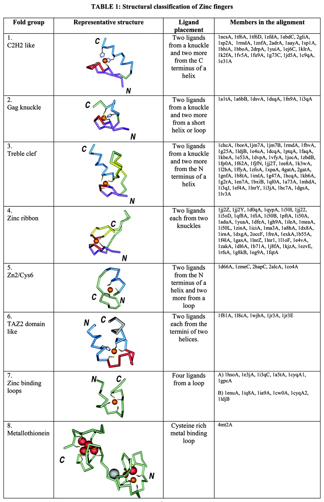

# Zinc Fingers

Zinc fingers are small protein domains in which zinc plays a structural role contributing to the stability of the domain. Zinc fingers are structurally diverse and are present among proteins that perform a broad range of functions in various cellular processes, such as replication and repair, transcription and translation, metabolism and signaling, cell proliferation and apoptosis. Zinc fingers typically function as interaction modules and bind to a wide variety of compounds, such as nucleic acids, proteins and small molecules.

## List of groups

Structures have been grouped into eight fold groups based on the structural properties around the zinc‐binding site. The ligands that chelate zinc (colored orange) are shown as ball‐and‐stick. The helices are colored cyan. The zinc knuckle connecting the two strands of the β‐hairpin is shown in red. The primary β‐strands that neighbor the knuckle are colored in purple and other strands in yellow. Loops are shown in light green. Other parts of the structure, which do not belong to the zinc‐binding region of the structure, are shown in gray. A brief description of each fold group is given. The last column lists representative members that belong to a particular fold group. No two structures in any given fold group share more than 50% identity in sequence at the zinc‐binding site. The figures in this table were made using Weblab viewer Pro of Accelrys.

1. Fold group 1: C2H2‐like finger
2. Fold group 2: Gag knuckle
3. Fold group 3: treble clef finger
4. Fold group 4: zinc ribbon
5. Fold group 5: Zn2/Cys6‐like finger
6. Fold group 6: TAZ2 domain‐like
7. Fold group 7: short zinc‐binding loops
8. Fold group 8: metallothioneins

